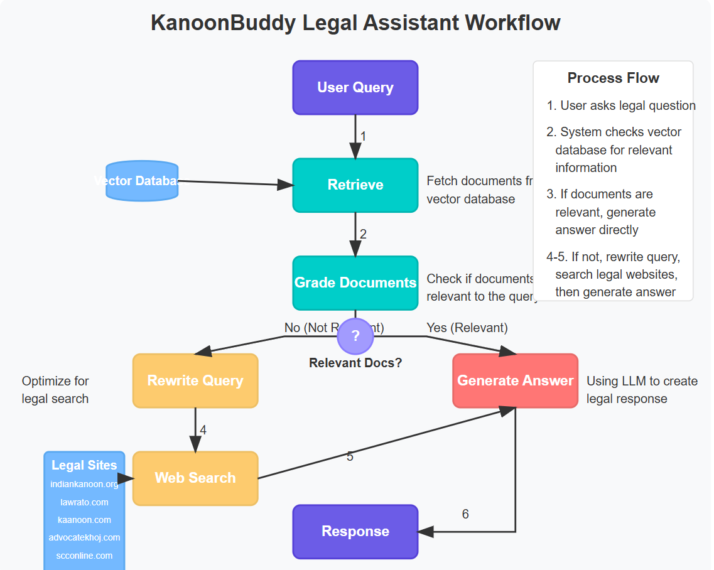

# KanoonBuddy

KanoonBuddy is a legal assistant powered by AI that helps users find relevant legal information, primarily focused on Indian law. It retrieves contextually relevant legal documents, grades their relevance, and answers queries using a combination of retrieval-augmented generation (RAG) and web search.



## Table of Contents
- [Features](#features)
- [Technologies Used](#technologies-used)
- [Installation](#installation)
- [Usage](#usage)
- [File Structure](#file-structure)
- [Future Improvements](#future-improvements)
- [Disclaimer](#disclaimer)
- [License](#license)

## Features
- **Legal Query Processing**: Uses LLM-based query rewriting to refine legal questions.
- **Document Retrieval**: Fetches relevant documents from a local FAISS vector database.
- **Relevance Grading**: Uses an LLM-based scoring system to determine document relevance.
- **Web Search Integration**: If no relevant documents are found, the system searches Indian legal websites.
- **Streamlit-based UI**: Provides a user-friendly interface for query input and responses.

## Technologies Used
- **Python**
- **Streamlit**
- **LangChain**
- **FAISS (Vector Database)**
- **LLMs (Groq, Gemini)**
- **Ollama Embeddings (snowflake-arctic-embed2:latest)** - One of the best embedding models available.
- **Tavily Web Search**
- **PyPDFLoader (Document Parsing)**

## Installation
```sh
# Clone this repository
git clone https://github.com/your-username/KanoonBuddy.git
cd KanoonBuddy

# Install dependencies
pip install -r requirements.txt

# Set up environment variables (create a .env file)
echo "LANGCHAIN_API_KEY=your_langchain_api_key" >> .env
echo "GROQ_API_KEY=your_groq_api_key" >> .env
echo "GEMINI_API_KEY=your_google_api_key" >> .env
echo "SEARCH=your_tavily_api_key" >> .env
echo "LANGCHAIN_PROJECT=your_project_name" >> .env

# Run the database script to process legal documents
python database.py

# Start the Streamlit application
streamlit run app.py
```

## Usage
1. Open the Streamlit UI in your browser.
2. Enter a legal query related to Indian law.
3. KanoonBuddy will retrieve relevant documents, perform web searches if needed, and generate an answer.
4. View the intermediate steps to understand how the response was generated.

## File Structure
- `app.py`: Main application file with Streamlit UI and query processing.
- `database.py`: Prepares and stores legal documents in a FAISS vector database.
- `embeddings/`: Directory containing precomputed embeddings.
- `requirements.txt`: Dependencies for the project.
- `.env`: Stores API keys and environment variables.

## Future Improvements
- Integration with more legal databases.
- Advanced legal reasoning using case law citations.
- Improved UI for better user interaction.

## Disclaimer
KanoonBuddy provides legal information for reference only and does not constitute legal advice. Always consult a professional for legal matters.

## License
This project is licensed under the MIT License.


